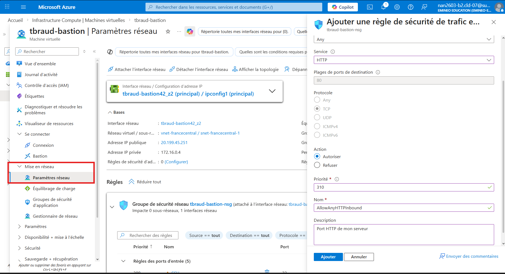

# TP

# Création de VM

- Avant il faut aussi créer un groupe de ressources
- Penser à changer le disque dur

# Connexion SSH

- Pour la prochaine fois y’a un dossier .ssh ici : "C:\Users\thoma\.ssh”

```jsx
ssh tbraud@20.199.45.251 -i "C:\Users\thoma\Desktop\SSH\tbraud-bastion_key.pem"
```

En gros faut mettre 

```jsx
ssh user@ippublique -i "path clé ssh"
```

# Mise a jour et installation de logiciel

```jsx
sudo apt update && sudo apt upgrade -y
sudo apt install -y wget curl vim git apache2 php php-mysql default-mysql-client
```

# Création de règle de port 80



Ensuite on peut accéder au site en http

# Créer un dossier


On peut télécharger tree pour tout voir une fois créer 

```jsx
apt install tree
```

## Copier le dossier

Dans le dossier on met ceci au préalable: 

```php
La connexion est ?
<?php
// Configuration de la connexion à la base de données
$servername = "cloud102-db.mysql.database.azure.com";
$username = "jesuisunadmin";
$password = "ON\\7>Ary~BLT64oj>iVUFO+Q{|(gdfE0";
$dbname = "cloud102-test";
// Création de la connexion avec MySQLi en mode orienté objet
$conn = new mysqli($servername, $username, $password, $dbname);
// Vérification de la connexion
if ($conn->connect_error) {
// En cas d'erreur, afficher un message et arrêter l'exécution
die("Échec de la connexion : "
. $conn->connect_error);
echo("Echec!");
} else {
// En cas de succès, afficher un message de confirmation
echo "Connexion réussie à la base de données MySQL !";
}
// Fermeture de la connexion
$conn->close();
?>
```

```bash
sudo rm /var/www/html/index.php
sudo cp index.php /var/www/html/
sudo systemctl restart apache2
```

# Connexion AzureDevOps

Sur azure on cherche DevOps puis on suit la logique

## Initialiser un projet git

```bash
git init
git config --global user.email "tbraud@mail.com"
git config --global user.name "TB"
git add .
git commit -m "first commit"
```

## Connexion via clé SSH

On génère une clé 

```bash
ssh-keygen -t rsa
id_rsa (sinon il est pas content)
```

Ensuite on cat ce fichier pour copier coller la clé 

```bash
cat id_rsa.pub
```


## Ajout de l’origine

```bash
git remote add origin git@ssh.dev.azure.com:v3/nan2603-b2cld-07/TPAzure/TPAzure
```

On push 

```bash
 git push origin master
```

# Dockerfile

```docker
# Utiliser l'image officielle PHP avec Apache
FROM php:8.1-apache
# Installer l'extension mysqli pour interagir avec MySQL
RUN docker-php-ext-install mysqli
# Copier le code de votre application dans le répertoire de l'application Apache
COPY ./src /var/www/html/
# Exposer le port 80 pour accéder à l'application via le navigateur
EXPOSE 80
```

On re push. 

# Créer un registre de conteneur

Cherche Containers registries


# Création d’une pipeline

Sur AzureDevOps


Malheureusement a cause de règle de sécurité, mis en place par nos admins, on ne peut pas le faire. 

On va donc passer par du docker

# Pour passer en SSH sur VS Code


Puis on ajoute un nouveau SSH par notre commande de connexion classique

Ensuite on va dans nos fichier et on je balade dans notre VM comme une fenêtre SSH classique

# Installer Docker sur notre VM Debian

https://docs.docker.com/engine/install/debian/

Mettre notre utilisateur dans le groupe docker donc en admin en sois

```yaml
sudo usermod -G docker tbraud (nom d'utilsateur)
```

Voir les images

```bash
sudo docker images
```

Supprimer une image 

```bash
sudo docker image rm <nom image>
```

Voir les conteneurs actif 

```bash
sudo docker ps
```

Voir les conteneurs ayant été actif 

```bash
sudo docker ps -a
```

Supprimer un conteneurs installer 

```bash
sudo docker rm <nom ou id>
```

Voir les images non tag 

```bash
sudo docker images --all
```

Tag une image durant un build 

```bash
sudo docker build -t tbraudapp:v0.1 
```

Lancer le docker

```bash
sudo docker start <id>
```

Ouvrir un shell sur notre docker 

```bash
sudo docker exec -it 1afc07b83e2a /bin/sh
```

Stop le docker 

```bash
sudo docker stop <id>
```

Quand je le modifie mon index.html via la commande dans le shell sa touche celui dans le container donc pas l’image ou celui de base dans le /home/projet 

Arrêter et supprimer les composes 

```bash
sudo docker compose down
```

Mettre sur Docker Hub

- Créer un compte puis un repo sur Docker Hub
- Changer le tag de notre image qu’on veut push, par le nom présent a l’endroit de la capture. C’est comme un nom de commit, pour identifier les versions


La commande est la suivante : 

```bash
sudo docker tag tbraudapp:v0.2  thbraud/azureb2:v0.2
```

Ensuite on push 

```bash
sudo docker push thbraud/azureb2:v0.2
```

Sa nous permet de changer dans notre docker compose, la ligne image

```yaml
services:
  web:
    image: thbraud/azureb2:v0.2
    restart: always
    ports:
      - 80:80
    depends_on:
      - data
  data: 
    image: mariadb
    restart: always
    environment:
      MARIADB_DATABASE: Cloud-TB
      MARIADB_USER: tbraud
      MARIADB_PASSWORD: motdepasse@4845454575
      MARIADB_ROOT_PASSWORD: motdepasseroot@de45248dsdfsd
```

Ensuite on supprimer complétement l’image pour qu’il build a chaque fois et donc mettre a jour automatiquement 

Notre docker compose devient 

```yaml
services:
  web:
    build: .
    restart: always
    ports:
      - 80:80
    depends_on:
      - data
  data: 
    image: mariadb
    restart: always
    environment:
      MARIADB_DATABASE: Cloud-TB
      MARIADB_USER: tbraud
      MARIADB_PASSWORD: motdepasse@4845454575
      MARIADB_ROOT_PASSWORD: motdepasseroot@de45248dsdfsd
```

On va maintenant rajouter des volumes, en gros on pourra le mettre a jour sans re build car il récupère le fichier dans le chemin donnée pour se mettre à jour. 

```yaml
services:
  web:
    build: .
    restart: always
    ports:
      - 80:80
    depends_on:
      - data
    volumes:
      - ./src:/var/www/html/
  data: 
    image: mariadb
    restart: always
    environment:
      MARIADB_DATABASE: Cloud-TB
      MARIADB_USER: tbraud
      MARIADB_PASSWORD: motdepasse@4845454575
      MARIADB_ROOT_PASSWORD: motdepasseroot@de45248dsdfsd
```

*Docker ne marche pas sur Windows car le noyau des hôtes Windows est incompatible avec les hôtes linux de docker. Avec WSL cela deviens possible.* 

# Création d’un .env pour cacher les variables importantes

```bash
DATABASE_URL=data
DATABASE_USER=tbraud
DATABASE_USER_PASSWORD=motdepasse@4845454575
DATABASE=Cloud-TB
MARIADB_ROOT_PASSWORD=motdepasseroot@de45248dsdfsd
```

Dans notre PHP on met toute les infos comme ceci : 

```bash
$servername = getenv('DATABASE_URL');
$username = getenv('DATABASE_USER');
$password = getenv('DATABASE_USER_PASSWORD');
$dbname = getenv('DATABASE');
```

Notre docker compose devient comme ceci : 

```yaml
services:
  web:
    build: .
    restart: always
    ports:
      - 80:80
    depends_on:
      - data
    volumes:
      - ./src:/var/www/html/
    environment: 
      DATABASE_URL: ${DATABASE_URL}
      DATABASE_USER: ${DATABASE_USER}
      DATABASE_USER_PASSWORD: ${DATABASE_USER_PASSWORD}
      DATABASE: ${DATABASE}
  data: 
    image: mariadb
    restart: always
    environment:
      MARIADB_DATABASE: ${DATABASE}
      MARIADB_USER: ${DATABASE_USER}
      MARIADB_PASSWORD: ${DATABASE_USER_PASSWORD}
      MARIADB_ROOT_PASSWORD: ${MARIADB_ROOT_PASSWORD}
```

## Connexion a la database

On créer la database sur Azure dans **Serveurs Azure Database pour MySQL**

```bash
mysql -h tbraudb22026.mysql.database.azure.com -u tbraud -p
```

Il faut au préalable avoir appuyer sur connecter sur Azure. 

Une fois connecter il faut créer puis utiliser notre database 

```sql
create dabase nomdb;
use nomdb;
```

Ensuite on peut quitter. 

On doit maintenant modifier notre Docker Compose pour correspondre a notre serveur

```yaml
services:
  web:
    build: .
    restart: always
    ports:
      - 80:80
    volumes:
      - ./src:/var/www/html/
    environment: 
      DATABASE_URL: ${DATABASE_URL}
      DATABASE_USER: ${DATABASE_USER}
      DATABASE_USER_PASSWORD: ${DATABASE_USER_PASSWORD}
      DATABASE: ${DATABASE}
  #data: 
    #image: mariadb
    #restart: always
    #environment:
      #MARIADB_DATABASE: ${DATABASE}
     # MARIADB_USER: ${DATABASE_USER}
      #MARIADB_PASSWORD: ${DATABASE_USER_PASSWORD}
      #MARIADB_ROOT_PASSWORD: ${MARIADB_ROOT_PASSWORD}
```

On modifie le .env

```bash
DATABASE_URL=tbraudb22026.mysql.database.azure.com
DATABASE_USER=tbraud
DATABASE_USER_PASSWORD=motdepasse@4845454575
DATABASE=cloudtb
MARIADB_ROOT_PASSWORD=motdepasseroot@de45248dsdfsd
```

Puis on va dans les paramètres de notre serveur 


On modifie require secure sur Off


On éteint, on relance sa fonctionne

# Retour à la création de pipeline


On valide 

On obtiens ce dossiers 


on save et run 

# Prérequis clef PAC


On crée notre clés. **Attention il faut la copier sinon on la verra plus** 


# Création de notre Agent Pool


Ensuite on clique sur notre pool, new agent et on exécute les commandes selon notre systèmes d’exploitations. 

Dans notre cas on doit installer les dépendances ssh

```yaml
sudo ./bin/installdependencies.sh
```

Toutes les commandes a faire : 

Il faut bien récupérer notre version du tar . 

```yaml
mkdir ~/agent_azure
cd ~/agent_azure
# récuperer le lien de "download the agent" pour le DL ensuite avec Wget
wget https://vstsagentpackage.azureedge.net/agent/4.252.0/vsts-agent-linux-x64-4.252.0.tar.gz
tar xvzf vsts-agent-linux-x64-4.252.0.tar.gz
```

Ensuite on lance la config

```yaml
/config.sh
```


On met les paramètre suivants 

Il faut juste dans agent pool mettre le nom de notre pool d’agent créer juste avant


On lance l’agent avec 

```yaml
./run.sh
```

Puis on retourne sur AzureDevOps

On le voit dans notre pool. Dans mon cas je l’ai laissé dans le pool par défaut il faudrait le mettre dans celui précédemment créer. 


Il faut ensuite modifier le fichier azure-pipelines.yaml. On change la partie pool en sa : 

pool: <nom agent> dans mon cas pool : Default

Notre pipeline va se lancer tout seule. Si le build marche on va recevoir le “build succeded”

# Faire fonctionner la pipeline sur Docker Hub

Il faut au préalable un service de connexion dans Azure DevOps mais aussi générer sur Docker Hub un token. Pour cela on va dans setting → Personnal access token → new access token. Après on lui met le nom qu’on veut, l’expiration, et les permissions. Il faut bien sauvegarder le token qu’il nous donne. 

Sur Azure DevOps : 


On cherche docker registry. Puis 

L’id correspond au nom d’utilisateurs 

Le docker password c’est le token

Apres le nom on met celui qu’on veut. On remettra ce nom la dans notre yaml. 


Changer le azure-pipelines.yaml comme ceci : 

```yaml
trigger:
- master

resources:
- repo: self

variables:
  # Nom de la service connection Docker Hub créée dans Azure DevOps
  dockerRegistryServiceConnection: 'DockerRegistry'

  # Repo Docker Hub au format: username/nomimage
  imageRepository: 'thbraud/azureb2'

  dockerfilePath: '$(Build.SourcesDirectory)/Dockerfile'
  buildContext: '$(Build.SourcesDirectory)'

  # Tags
  tag: '$(Build.BuildId)'

stages:
- stage: BuildAndPush
  displayName: Build & Push image to Docker Hub
  jobs:
  - job: BuildAndPush
    displayName: Build and push
    pool: Default
    steps:
    - task: Docker@2
      displayName: Build and push
      inputs:
        command: buildAndPush
        containerRegistry: $(dockerRegistryServiceConnection)
        repository: $(imageRepository)
        dockerfile: $(dockerfilePath)
        buildContext: $(buildContext)
        tags: |
          $(tag)
          latest
```

On le commit et c’est fini ! Le build de la pipeline doit donc marcher et sur le Docker Hub,  on a une nouvelle version a chaque rerun de la pipeline. 

# Mettre le tout en ligne

## Création d’un **Container Apps**


On doit juste choisir le nom et notre région


Dans l’onglet variables d’environnement on dois mettre nos variables du .env avec exactement le même nom et leur valeur. 


On peut maintenant déployer et créer notre container apps. Une choix cela fait on accède a la ressource, on clique sur le liens donnée par azure et on accède à notre site.
